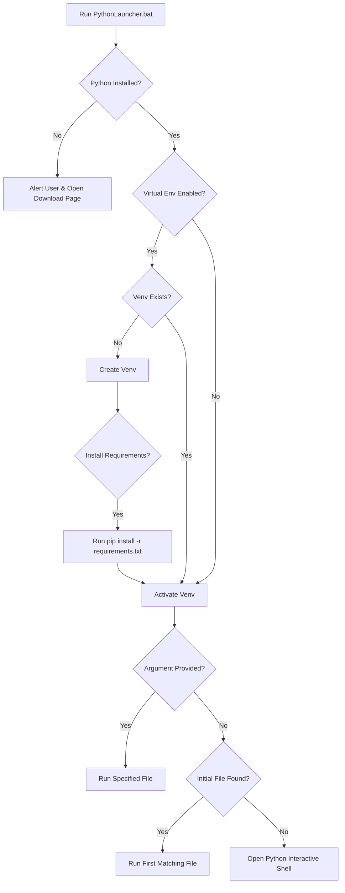

## What is Windows Python Launcher?

Windows Python Launcher is a lightweight, customizable batch script designed to streamline the process of running Python projects on Windows. It eliminates the complexity of manual environment setup by automatically detecting Python installations, managing virtual environments, and handling dependencies.

<CardGroup cols={2}>
  <Card title="Zero Configuration" icon="rocket">
    Works out of the box with sensible defaults. Just drop it in your project folder and run.
  </Card>
  <Card title="Highly Customizable" icon="sliders">
    Configure Python versions, virtual environments, window behavior, and more through simple variables.
  </Card>
  <Card title="Portable" icon="box">
    Perfect for distributing Python projects without compilation. Users don't need to know about venv or pip.
  </Card>
  <Card title="Developer Friendly" icon="code">
    Supports drag-and-drop file execution, command-line arguments, and auto-detection of entry points.
  </Card>
</CardGroup>

## Why Use This Launcher?

### Problems It Solves

**1. Complex Environment Setup**

Traditional Python project setup requires multiple manual steps:

```bash
# Without the launcher
python -m venv venv
venv\Scripts\activate
pip install -r requirements.txt
python main.py
```

With Windows Python Launcher, all of this happens automatically with a single double-click.

**2. Distribution Challenges**

When sharing Python projects with non-technical users, you typically face:
- Users don't have Python installed
- Users don't understand virtual environments
- Dependencies aren't installed correctly
- Finding the correct entry point is confusing

<Note>
The launcher handles all of these issues automatically, making your Python projects as easy to run as any Windows application.
</Note>

**3. Testing and Development**

For developers testing multiple Python projects or versions:
- Quickly switch between Python versions
- Test with different configurations
- Run scripts with drag-and-drop
- Manage multiple virtual environments

### Key Features

<Accordion title="Python Version Detection">
The launcher automatically detects installed Python versions and can use either:
- The Windows `py` launcher (recommended) with version selection
- Direct path to a specific Python executable
- Portable Python installations

```batch title="PythonLauncher.bat"
::Set the python version to use. Will be ignored if pythondir is not py or py.exe.
set pythonversion=3.11
::Used to configure the python exe to use. Useful when using portable python versions.
set pythondir=py
```
</Accordion>

<Accordion title="Smart Entry Point Detection">
No need to specify which file to run. The launcher automatically searches for common entry points:

```batch title="PythonLauncher.bat"
::This script can auto detect what initial files to run
set initialfiles="run.py" "main.py" "app.py"
```

You can customize this list to match your project structure. The first matching file will be executed.
</Accordion>

<Accordion title="Virtual Environment Management">
Automatically creates and activates a virtual environment on first run:

```batch title="PythonLauncher.bat"
::Set if a venv will be created before runing the python file.
set usevenv=1
::Used to define the name of the venv that will be created and used.
set venvname=pyvenv
```

The venv is only created once. Subsequent runs reuse the existing environment for faster startup.
</Accordion>

<Accordion title="Automatic Dependency Installation">
Installs packages from `requirements.txt` when creating the virtual environment:

```batch title="PythonLauncher.bat"
::Set if a requirements.txt file will be installed when creating the venv.
set installrequirementsfile=1
::Used to define the requirements file that will be installed.
set requirementsfile=requirements.txt
```

<Warning>
Packages are only installed during venv creation. If you update `requirements.txt`, delete the venv folder to trigger a fresh installation.
</Warning>
</Accordion>

<Accordion title="Flexible Execution Modes">
Multiple ways to run your Python code:

1. **Double-click** - Runs the first detected initial file
2. **Drag-and-drop** - Drop any `.py` file onto the batch script to run it
3. **Command-line arguments** - Pass arguments to your Python script

```batch title="PythonLauncher.bat"
::Used to toggle if arguments passed to this file will be passed to the python file.
::Will disable running a python file when dragging it over this file if enabled.
set passarguments=0
```
</Accordion>

<Accordion title="Window Behavior Control">
Customize how the command prompt window appears:

```batch title="PythonLauncher.bat"
::Used to define the title of the cmd that will execute the python file.
set windowname=Python

::Toggle if the cmd that runs the python file should start minimized.
set minimizedcmd=0

::Toggle if the cmd window should be closed when the python file execution has ended.
set autoclosecmd=0
```

Perfect for creating a clean user experience or running background processes.
</Accordion>

<Accordion title="User-Friendly Error Handling">
Automatically detects if Python is not installed and guides users:

```batch title="PythonLauncher.bat"
::Set if the user will be alerted and taken to the python download page
::if python is not installed.
set alertifpynotinstalled=1
```

When enabled, opens the Python download page automatically if no Python installation is found.
</Accordion>

## Use Cases

<Steps>
  <Step title="Project Distribution">
    Include the launcher with your Python project. Users can run your application without knowing anything about Python, pip, or virtual environments.
  </Step>
  
  <Step title="Development Testing">
    Quickly test different Python versions or configurations by adjusting variables. No need to manually activate/deactivate environments.
  </Step>
  
  <Step title="Educational Projects">
    Students can focus on learning Python without struggling with environment setup. Teachers can standardize the execution environment.
  </Step>
  
  <Step title="Internal Tools">
    Deploy Python scripts to non-technical team members. They double-click the launcher, and everything just works.
  </Step>
</Steps>

## How It Works

When you run the launcher, it follows this workflow:



<Note>
The entire process is automatic. Users only see a command prompt window with their Python application running.
</Note>

## What's Next?

Ready to get started? Head over to the [Quickstart](/quickstart) guide to set up the launcher in your project in under 2 minutes.